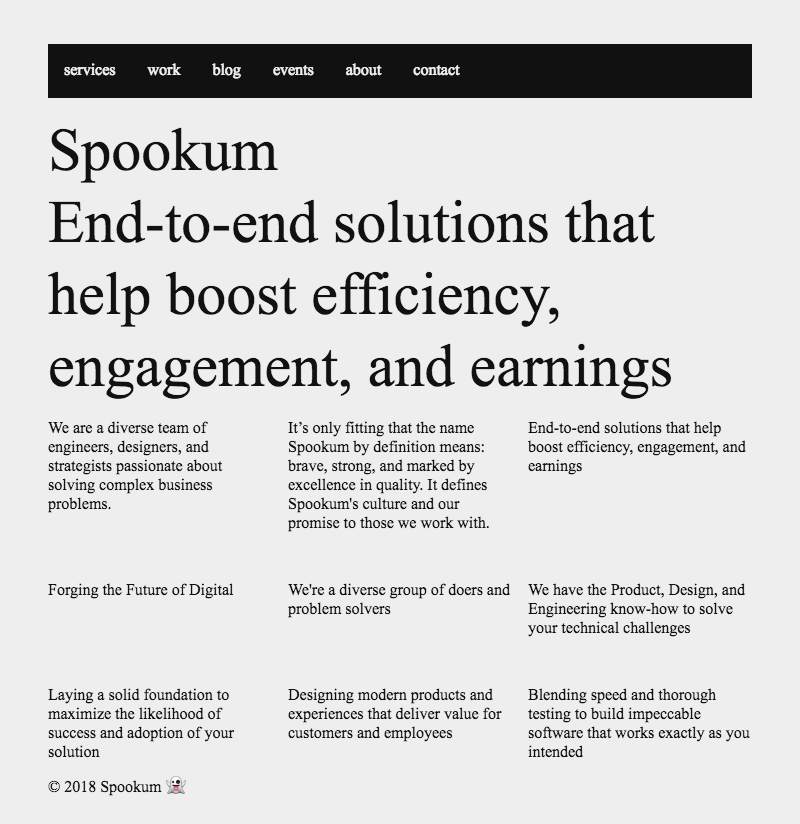
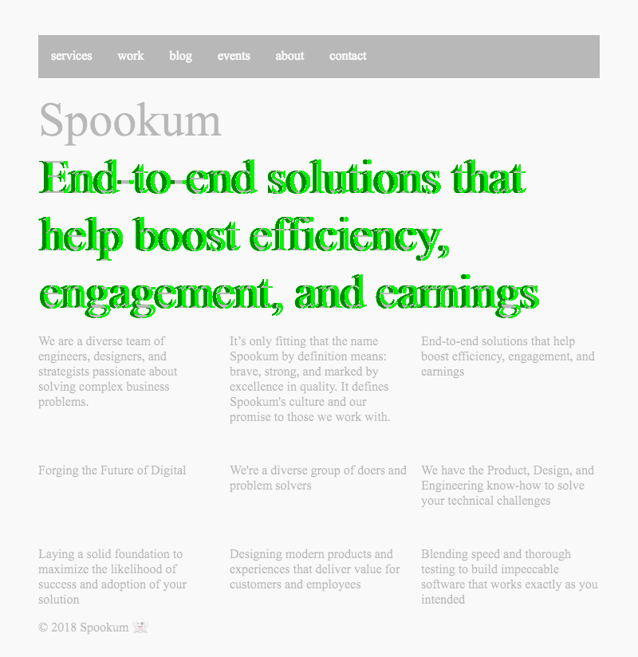

# visual regression testing

aka <abbr title="California Style Sheets">CSS</abbr> Regression Testing

A very contrived proof-of-concept

## ℹ️ about

*visual regression testing* is a funny weird cool little thing where you use a headless browser to load up and take screenshots of your website after you make changes to your CSS or whatever.

Then you use a visual diffing utility to compare those new "real world" screenshots to a collection of "blessed" or approved or canonical screenshots that you already have from designs or mockups or from previous versions of the site.

for example, here is the layout of the `test` directory after testing one route
('/' or "index") at three screen sizes (iPhone, iPad, and 800x600):

```
.
└── test
    └── regression
        ├── blessedImages
        │   ├── 375x812
        │   │   └── index.png
        │   ├── 768x1024
        │   │   └── index.png
        │   └── 800x600
        │       └── index.png
        ├── diffs
        │   ├── 375x812
        │   │   └── index.png
        │   ├── 768x1024
        │   │   └── index.png
        │   └── 800x600
        │       └── index.png
        ├── index.js
        └── screenshots
            ├── 375x812
            │   └── index.png
            ├── 768x1024
            │   └── index.png
            └── 800x600
                └── index.png
```

Using VRT you will be notified whether that CSS rule you just tweaked also made
changes on other pages in your project, and you will also have a visual
representation of what has changed.

this work is inspired by a talk [Emily Morehouse] gave at [dinosaurjs] 2018.

[Emily Morehouse]:https://twitter.com/emilyemorehouse/status/1011324145542418432
[dinosaurjs]:https://twitter.com/dinosaur_js

## 🙇‍♂️ How?

This example relies primarily on two things, and then a third thing:

1. headless chrome via [puppeteer] for browser-ing and screenshot-ing 

2. [resemble.js] for visual diffs.

3. [tape] for writing tests.

[puppeteer]:https://github.com/GoogleChrome/puppeteer/blob/v1.10.0/docs/api.md
[resemble.js]:https://github.com/HuddleEng/Resemble.js
[tape]:https://medium.com/javascript-scene/why-i-use-tape-instead-of-mocha-so-should-you-6aa105d8eaf4

## 📷 example visual output

Here's a screenshot of the sample page.



Here's the same page after making a slight change. You may not be able to see
the difference between this image and the previous image. But the change is
there, I promise.


Don't believe me? Well here's the proof: the visual diff of these two images,
in which you can see incontrovertible proof of the results of the extra padding
applied to the element.



## 💻 example terminal output

what does it look like to run the tests?

The below examples are using `tap-nyan` to filter the TAP output because
`tap-nyan` is both terse (we don't need the full stack trace here) but also has
a nyan cat: it's the best of both worlds!

Here's what running a passing regression test looks like on the '/' route with
three different screen sizes.

```
⇒  yarn run test/regression
yarn run v1.12.3
$ node test/regression | tap-nyan
 3   -_-_,------,
 0   -_-_|   /\_/\
 0   -_-^|__( ^ .^)
     -_-  ""  ""
  Pass!
✨  Done in 3.65s.
```

Here's what the failing example from the previous section looks like.

```
⇒  yarn run test/regression
yarn run v1.12.3
$ node test/regression | tap-nyan
 0   -_-_,------,
 3   -_-_|   /\_/\
 0   -_-^|__( x .x)
     -_-  ""  ""
  Failed Tests: There were 3 failures

    ✗ # index
: 768x1024/index is off by 4.3%. see: test/regression/diffs/768x1024/index.png
    ✗ # index
: 800x600/index is off by 5.13%. see: test/regression/diffs/800x600/index.png
    ✗ # index
: 375x812/index is off by 3.09%. see: test/regression/diffs/375x812/index.png
✨  Done in 3.72s.

```

## 🏃‍♀️ Run it

1. `yarn` -- install deps

2. `yarn run dev` -- you need a server running so the tests can visit your site

3. `yarn run test/regression` -- run the tests

## 🛠 TODO

0. every new change to the site will cause tests to fail unless every new
   change to the site is accompanied by a change to your collection of blessed
   images. there should be a way to make this less painful. perhaps a utility
   to force the test to pass by copying the new screenshot to the appropriate
   corresponding spot in `blessedImages`.

      Reverse engineer this output:

      ```
      800x600/index is off by 5.13%. see: test/regression/diffs/800x600/index.png
      approve changes and copy test/regression/screenshots/800x600/index.png to test/regression/blessedImages/800x600/ [yN]:
      ```
      

1. right now if you add a new screen size the tests will crash when fs tries to
   open a directory that isn't there. some kind of `beforeAll` check that
   creates the necessary file structures before trying to access them should
   fix this.

2. fix the question of when to run regressions. is this a pre-commit githook? a
   pre-push?

3. make a nicer way to add routes to the test suite.

4. ???
